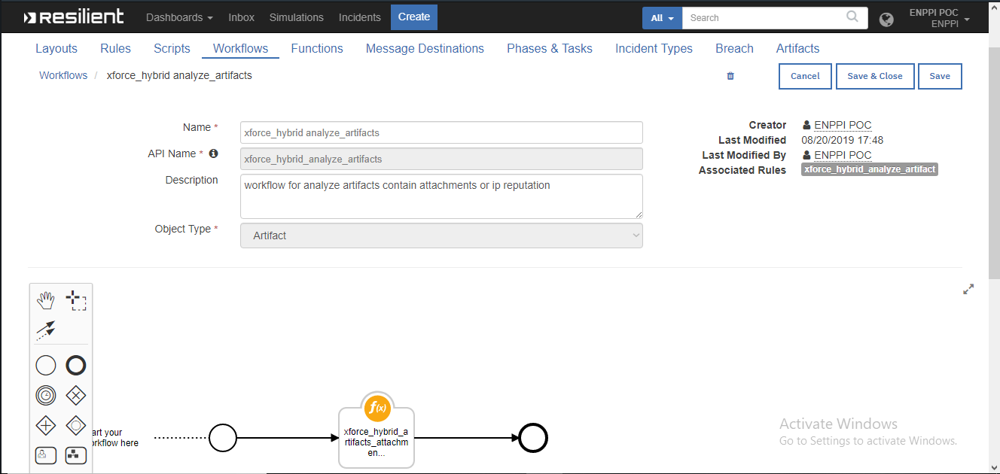

# XFORCE_HYBRID_ITEGRATION_RESILIENT

## Table of Contents
  - [app.config settings](#appconfig-settings)
  - [Function Inputs](#function-inputs)
  - [Function Output](#function-output)
  - [Pre-Process Script](#pre-process-script)
  - [Post-Process Script](#post-process-script)
  - [Rules](#rules)
---

**This package contains a one function that executes a XFORCE and HYBRID Sandbox Analysis of an Attachment or Artifact if it ip address or attachment and returns the Analysis Results to IBM Resilient.**

**this function implmented  for incident open with suspect files and artifacts**

This function comes with two workflows and rules, which retrieve information from a attachment, scan ip address reputation, and query hash files. An example is shown below.

**this function inputs**


**workflow for attachment**


**workflow for artifact**


## app.config settings
```
[fn_xforce_hybrid]
xforce_api=<enter xforce url api>
xforce_api_key = <enter xforce api key>
xforce_api_password=<enter xforce api password>
xforce_malware_endpoint = <malware endpoint>
xforce_ipReputation_endpoint = <ip endpoint>
hybrid_api = <hybrid url api>
hybrid_scan_endpoint = <scan file endpoint>
hybrid_api_key = <enter hybrid api key>
```

## URL Void Function Inputs
| Function inputs | Type | Required | Example |
| ------------- | :--: | :-------:| ------- |
| `attachment_name` | `String` | No | `"suspect_file"` |
| `incident_id` | `Number` | Yes | `5` |
| `attachment_id` | `Number` | Yes | `5` |
| `artifact_id` | `Number` | Yes | `5` |

## Pre-Process Script
**WORKFLOW ATTACHMENT**
This example sets the `attachment_id` input to the value of the incident's attachment.

```python
inputs.attachment_name = attachment.name
inputs.attachment_id   = attachment.id
inputs.incident_id = incident.id
```

## Post-Process Script
**WORKFLOW ARTIFACT**
This example adds a notes to the incident stating how many detections were found on the artifact if it contain ip or attachment and display  the information as user notifications.

```python
green = "#45bc27"
red = "#ff402b"
yellow = "#ffc022"

if results.label == "ip":
  if results.status != "InfectedIP":

    noteText = """ 
    <br>XFORCE ARTIFACT ANALYSIS COMPLETE <br>
    <b>STATUS:</b> <b style = "color:{2}"> {0} </b> <br>
    <b>IP:</b> <b> {1} </b>
    """.format(results.status , results.ip , green)

  else:
      if len(results.malware_info) > 0:
        malware_status = """ """
        for dic in results.malware_info:
          for key , value in dic.items():
            malware_status += """<li>{} -> {} <br></li> """.format(key, value)
        noteText = """ 
        <br>XFORCE ARTIFACT ANALYSIS COMPLETE <br>
        <b>STATUS:</b> <b style = "color:{3}"> {0} </b> <br>
        <b>TYPE:</b> <b>{1} </b><br>
        <b>FAMILY:</b> <b>{2}</b><br>
        <b> MALWARE INFO</b> <br>
        <ul>
         {4}
        </ul>
        """.format(results.status , results.type , results.family , red , malware_status)
  


    
elif results.label == "attachment_suspect":
  if results.status == "danger":
      attachment_status = """ """
      color = None
      for dic in results.scanners:
        for key , value in dic.items():
          if value == "malicious":
            color = red
            attachment_status += """<li style="color:{2}">{0} -> {1} <br></li> """.format(key, value, color)
          elif value == "no-result":
            color = yellow
            attachment_status += """<li style="color:{2}">{0} -> {1} <br></li> """.format(key, value, color)
          else:
            attachment_status += """<li>{0} -> {1} <br></li> """.format(key, value)
      noteText = """ 
      <br>XFORCE ARTIFACT ANALYSIS COMPLETE <br>
      <b>STATUS:</b> <b style = "color:{2}"> {0} </b> <br>
      <b> ARTIFACT ATTACHMENT INFO</b> <br>
      <ul>
      {1}
      </ul>
      """.format(results.status  , attachment_status ,   red)
  else:
      attachment_status = """ """
      for dic in results.scanners:
        for key , value in dic.items():
          if value == "no-result":
            attachment_status += """<li style="color:{2}">{0} -> {1} <br></li> """.format(key, value, green)
          else:
              attachment_status += """<li>{0} -> {1} <br></li> """.format(key, value)
      noteText = """ 
      <br>XFORCE ARTIFACT ANALYSIS COMPLETE <br>
      <b>STATUS:</b> <b style = "color:{2}"> {0} </b> <br>
      <b> ARTIFACT ATTACHMENT INFO</b> <br>
      <ul>
      {1}
      </ul>
      """.format(results.status  , attachment_status ,   green)
    


incident.addNote(helper.createRichText(noteText))  
```

## Rules
| Rule Name | Object Type | Workflow Triggered | Conditions |
| --------- | :---------: | ------------------ | ---------- |
| Example: xforce_scan_file_hash | `Attachment` | `Example: Retrieve file hashes Information if it malicious or not` 
| Example: xforce_hybrid_analyze_artifact| `Artifact` | `Example: parse artifact if it ip or attachment and retrieve information status` 


    resilient-circuits codegen -p fn_xforce_hybrid [-f xforce_hybrid_artifacts_attachments] [-w xforce_hybrid_analyze_artifacts xforce_file_hash]


You must edit the `setup.py` before distribution;
it should contain your actual contact and license information.

To install in "development mode"

    pip install -e ./fn_xforce_hybrid/

After installation, the package will be loaded by `resilient-circuits run`.


To uninstall,

    pip uninstall fn_xforce_hybrid


To package for distribution,

    python ./fn_xforce_hybrid/setup.py sdist

The resulting .tar.gz file can be installed using

    pip install <filename>.tar.gz
